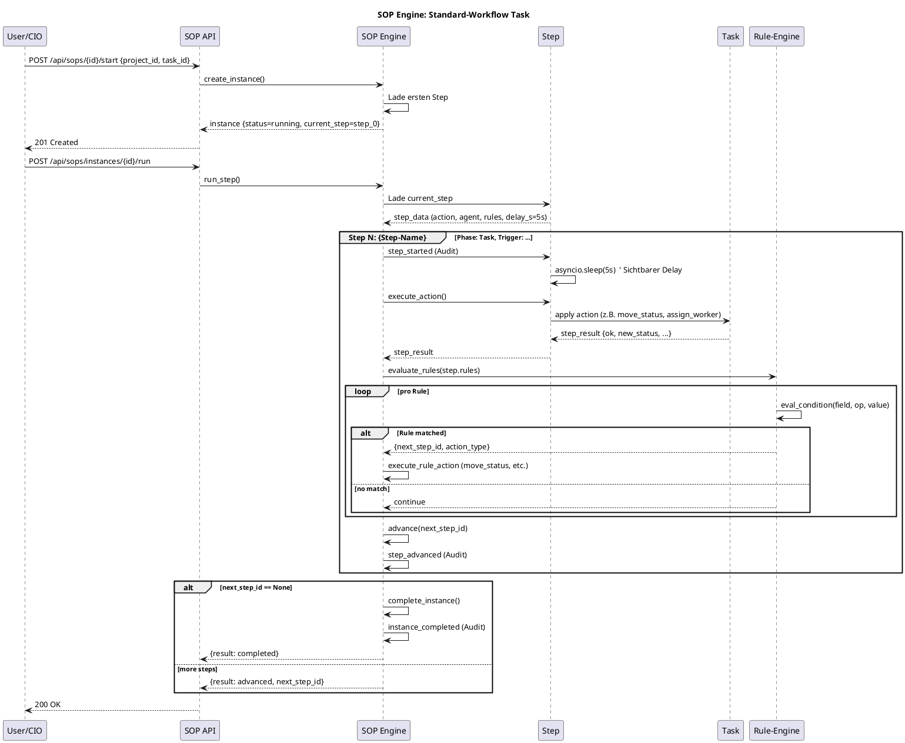

# SOP-Architektur (Standard Operating Procedures)

> **Status:** 16.06.2026 — v2.0-alpha+1 (Generischer Regelprozess)
> **User-Direktive:** 15.06.2026 — "SOP generisch beschreiben mit mehreren wiederverwendbaren Regelprozessen"

## Übersicht

Das **SOP-System** (Standard Operating Procedures) ersetzt den bisher hartcodierten
Workflow durch eine **generische, datenbankgestützte Engine**, die beliebige
Regelprozesse ausführen kann.

```
┌──────────────────────────────────────────────────────────────────────┐
│  FRONTEND (React 19 + Vite)                                          │
│  - /sops: SOP-Liste, Builder-Wizard, BPMN/UML-Visualisierung        │
└──────────────────────┬───────────────────────────────────────────────┘
                       │ REST
                       ▼
┌──────────────────────────────────────────────────────────────────────┐
│  BACKEND (FastAPI)                                                   │
│  Routers: /api/sops, /api/sops/instances                            │
│  Engine:  SOPEngine (sop_engine.py)                                  │
│           - Trigger auswerten                                        │
│           - Action an Agent delegieren                               │
│           - Wenn-Dann-Rules prüfen                                  │
│           - Sub-SOP spawnen                                         │
└──────────────────────┬───────────────────────────────────────────────┘
                       │ SQL
                       ▼
┌──────────────────────────────────────────────────────────────────────┐
│  DATENBANK                                                           │
│  - sops (Definition)                                                 │
│  - sop_steps (Schritte: Phase, Trigger, Action, Agent, Expected)     │
│  - sop_step_rules (Wenn-Dann-Logik)                                  │
│  - sop_instances (laufende Ausführungen)                             │
│  - sop_executions (Audit-Log)                                        │
└──────────────────────────────────────────────────────────────────────┘
```

## Datenmodell

### `sops` (Definition)
| Spalte | Typ | Beschreibung |
|--------|-----|--------------|
| `id` | VARCHAR(32) PK | UUID-Hash |
| `name` | VARCHAR(255) | Eindeutiger Name (z.B. "Standard-Workflow Task") |
| `description` | TEXT | Markdown-Beschreibung |
| `category` | VARCHAR(64) | task / review / release / incident / custom |
| `version` | INT | Default 1 |
| `parent_sop_id` | FK → sops.id | Sub-SOP-Hierarchie |
| `is_template` | BOOLEAN | Kann als Vorlage dienen |
| `default_delay_s` | FLOAT | Default 5.0 (User-Transparenz) |
| `bpmn_xml` | TEXT | Persistierte BPMN-Repräsentation |
| `uml_sequence_diagram` | TEXT | Persistierte PlantUML-Quelle |

### `sop_steps` (Schritte)
| Spalte | Typ | Beschreibung |
|--------|-----|--------------|
| `id` | VARCHAR(32) PK | UUID-Hash |
| `sop_id` | FK → sops.id | Zugehörige SOP |
| `step_order` | INT | Reihenfolge |
| `name` | VARCHAR(255) | Schritt-Name |
| `phase` | VARCHAR(64) | **Task** / **Decision** / **Sub-SOP** / **End** / **Wait** / **Notification** |
| `trigger` | VARCHAR(255) | z.B. `task_created`, `status_changed:todo`, `manual` |
| `action` | VARCHAR(128) | z.B. `review_task`, `move_status`, `spawn_sop`, `assign_worker` |
| `action_params` | JSON | Parameter für die Action |
| `agent` | VARCHAR(64) | **CIO**, **pi-coder**, **pi-tester**, **pi-reviewer**, **pi-fixer**, **CEO-digital**, **system**, **user** |
| `expected_result` | TEXT | Was soll rauskommen |
| `success_criteria` | JSON | Liste von Kriterien |
| `next_step_id` | FK → sop_steps.id | Erfolgs-Verzweigung |
| `fail_step_id` | FK → sop_steps.id | Fehler-Verzweigung |
| `on_sub_sop_step_id` | FK | Nach Sub-SOP fertig |
| `delay_s` | FLOAT | Sichtbarer Delay (5.0) |

### `sop_step_rules` (Wenn-Dann)
| Spalte | Typ | Beschreibung |
|--------|-----|--------------|
| `id` | VARCHAR(32) PK | |
| `step_id` | FK → sop_steps.id | |
| `condition_field` | VARCHAR(128) | Kontext-Variable (z.B. `step_ok`, `cio_approved`) |
| `condition_operator` | VARCHAR(16) | `eq` / `ne` / `gt` / `lt` / `in` / `not_in` / `contains` / `is_true` / `is_false` / `is_none` |
| `condition_value` | JSON | Vergleichswert |
| `action_type` | VARCHAR(64) | `move_status` / `approve_triage` / `start_work` / `submit_review` / `tester_approve` / `tester_reject` / `cio_final_approve` / `cio_final_reject` / `create_subtask` / `spawn_sop` / `escalate` / `block` / `complete` / `noop` |
| `action_target` | VARCHAR(255) | Zielstatus / SOP-ID |
| `action_params` | JSON | Action-Parameter |

### `sop_instances` (Laufende Ausführung)
| Spalte | Typ | Beschreibung |
|--------|-----|--------------|
| `id` | VARCHAR(32) PK | |
| `sop_id` | FK → sops.id | Welche SOP läuft |
| `project_id` | FK → projects.id | Optional: an Projekt gebunden |
| `task_id` | FK → tasks.id | Optional: an Task gebunden |
| `current_step_id` | FK → sop_steps.id | Aktueller Schritt |
| `status` | VARCHAR(32) | `running` / `paused` / `waiting_sub_sop` / `completed` / `failed` / `blocked` |
| `parent_instance_id` | FK → sop_instances.id | Sub-SOP-Hierarchie |
| `context` | JSON | Laufzeit-Variablen (z.B. `step_ok`, `cio_approved`) |
| `started_at` | TIMESTAMP | |
| `completed_at` | TIMESTAMP | |

### `sop_executions` (Audit-Log)
| Spalte | Typ | Beschreibung |
|--------|-----|--------------|
| `id` | BIGINT PK | |
| `instance_id` | FK → sop_instances.id | |
| `step_id` | FK → sop_steps.id | |
| `ts` | TIMESTAMP | |
| `event` | VARCHAR(64) | `instance_started`, `step_started`, `step_completed`, `rule_evaluated`, `step_advanced`, `instance_completed`, `instance_failed`, `subtask_created`, `sub_sop_spawned`, `sub_sop_completed`, `escalated` |
| `agent` | VARCHAR(64) | |
| `details` | JSON | Event-Details |
| `duration_ms` | INT | |
| `success` | BOOLEAN | |

## Engine-Ablauf

```
┌────────────────────────────────────────────────────────────────────┐
│  1. start_instance(sop_id, project_id, task_id)                    │
│     -> Lade ersten Step (step_order=0)                             │
│     -> setze current_step_id, status=running                       │
│     -> Audit: instance_started                                     │
└────────────────────────────────┬───────────────────────────────────┘
                                 ▼
┌────────────────────────────────────────────────────────────────────┐
│  2. run_step(instance)                                             │
│     -> Lade aktuellen Step                                         │
│     -> Audit: step_started                                         │
│     -> asyncio.sleep(step.delay_s) [5s]                            │
│     -> execute_action(instance, step)                              │
│         z.B. move_status, assign_worker, spawn_sop                │
│     -> Audit: step_completed                                       │
└────────────────────────────────┬───────────────────────────────────┘
                                 ▼
┌────────────────────────────────────────────────────────────────────┐
│  3. evaluate_rules(instance, step, step_result)                    │
│     -> Iteriere Rules (sortiert nach rule_order)                  │
│     -> eval_condition(field, operator, value)                      │
│     -> Bei Match: execute_rule_action (move_status etc.)          │
│     -> Audit: rule_evaluated                                       │
│     -> Liefert next_step_id                                        │
└────────────────────────────────┬───────────────────────────────────┘
                                 ▼
┌────────────────────────────────────────────────────────────────────┐
│  4. advance(instance, next_step_id)                                │
│     -> Setze current_step_id                                       │
│     -> Audit: step_advanced                                        │
└────────────────────────────────┬───────────────────────────────────┘
                                 ▼
┌────────────────────────────────────────────────────────────────────┐
│  5. Wenn next_step_id == None: complete_instance                   │
│     -> status=completed, completed_at=now                          │
│     -> Audit: instance_completed                                   │
│     -> Parent-Instance (falls Sub-SOP) reaktivieren                │
└────────────────────────────────────────────────────────────────────┘
```

## UML-Sequenzdiagramm (PlantUML)



## BPMN 2.0 (Auszug für Standard-Workflow)

```xml
<?xml version="1.0" encoding="UTF-8"?>
<bpmn:definitions xmlns:bpmn="http://www.omg.org/spec/BPMN/20100524/MODEL"
                  id="Definitions_sop_id" targetNamespace="http://pi-dashboard-2/sops">
  <bpmn:process id="Process_sop_id" name="Standard-Workflow Task" isExecutable="true">
    <bpmn:documentation>
      Generischer Standard-Workflow: TRIAGE -> TODO -> IN_PROGRESS -> REVIEW -> BLOCK -> DONE
    </bpmn:documentation>

    <bpmn:startEvent id="start" name="SOP Start" />

    <!-- Step 1: CIO Triage Review -->
    <bpmn:serviceTask id="step_1" name="CIO Triage Review"
                      activiti:class="pi-dashboard.sop.StepAction">
      <bpmn:documentation>
        Phase: Task | Agent: CIO | Trigger: task_created |
        Action: review_task | Expected: Task ist vollstaendig |
        Delay: 5.0s
      </bpmn:documentation>
    </bpmn:serviceTask>
    <bpmn:exclusiveGateway id="gw_1" name="CIO Decision" />

    <!-- Step 2: Worker Assignment -->
    <bpmn:serviceTask id="step_2" name="Worker Assignment"
                      activiti:class="pi-dashboard.sop.StepAction">
      <bpmn:documentation>Phase: Task | Agent: CIO | Action: assign_worker</bpmn:documentation>
    </bpmn:serviceTask>

    <!-- Step 3: Worker Implementation -->
    <bpmn:serviceTask id="step_3" name="Worker Implementation"
                      activiti:class="pi-dashboard.sop.StepAction">
      <bpmn:documentation>Phase: Task | Agent: pi-coder</bpmn:documentation>
    </bpmn:serviceTask>

    <!-- Step 4: Tester Code-Review -->
    <bpmn:serviceTask id="step_4" name="Tester Code-Review"
                      activiti:class="pi-dashboard.sop.StepAction">
      <bpmn:documentation>Phase: Task | Agent: pi-tester</bpmn:documentation>
    </bpmn:serviceTask>
    <bpmn:exclusiveGateway id="gw_4" name="Tester Decision" />

    <!-- Step 5: CIO Final-Review -->
    <bpmn:serviceTask id="step_5" name="CIO Final-Review"
                      activiti:class="pi-dashboard.sop.StepAction">
      <bpmn:documentation>Phase: Task | Agent: CIO</bpmn:documentation>
    </bpmn:serviceTask>
    <bpmn:exclusiveGateway id="gw_5" name="CIO Final Decision" />

    <!-- Step 6: Done -->
    <bpmn:serviceTask id="step_6" name="Done"
                      activiti:class="pi-dashboard.sop.StepAction">
      <bpmn:documentation>Phase: End | Agent: system</bpmn:documentation>
    </bpmn:serviceTask>

    <bpmn:endEvent id="end" name="SOP End" />

    <!-- Sequence Flows -->
    <bpmn:sequenceFlow id="flow_start" sourceRef="start" targetRef="step_1" />
    <bpmn:sequenceFlow id="flow_1_2" sourceRef="step_1" targetRef="step_2" />
    <bpmn:sequenceFlow id="flow_2_3" sourceRef="step_2" targetRef="step_3" />
    <bpmn:sequenceFlow id="flow_3_4" sourceRef="step_3" targetRef="step_4" />
    <bpmn:sequenceFlow id="flow_4_5" sourceRef="step_4" targetRef="step_5" />
    <bpmn:sequenceFlow id="flow_5_6" sourceRef="step_5" targetRef="step_6" />
    <bpmn:sequenceFlow id="flow_6_end" sourceRef="step_6" targetRef="end" />

    <!-- Conditional End-Flows (Block / Complete) -->
    <bpmn:sequenceFlow id="flow_block" sourceRef="step_1" targetRef="end">
      <bpmn:conditionExpression xsi:type="bpmn:tFormalExpression">
        $step_ok is_false True
      </bpmn:conditionExpression>
    </bpmn:sequenceFlow>
  </bpmn:process>
</bpmn:definitions>
```

## API-Referenz

| Method | Endpoint | Beschreibung |
|--------|----------|--------------|
| `GET` | `/api/sops` | Liste aller SOPs (filterbar nach `category`) |
| `POST` | `/api/sops` | Neue SOP erstellen (inkl. Steps + Rules) |
| `GET` | `/api/sops/{id}` | SOP-Details inkl. Steps + Rules |
| `PUT` | `/api/sops/{id}` | SOP-Metadaten aktualisieren |
| `DELETE` | `/api/sops/{id}` | SOP löschen (CASCADE) |
| `GET` | `/api/sops/{id}/bpmn` | BPMN 2.0 XML (auto-generiert oder persistiert) |
| `GET` | `/api/sops/{id}/uml` | PlantUML-Sequenzdiagramm (auto-generiert) |
| `POST` | `/api/sops/{id}/start` | SOP-Instance starten |
| `POST` | `/api/sops/seed-defaults` | Default-Task-SOP seeden |
| `GET` | `/api/sops/instances/all` | Liste aller Instances |
| `GET` | `/api/sops/instances/{id}` | Instance-Details + Execution-Log |
| `POST` | `/api/sops/instances/{id}/run` | Aktuellen Step ausführen (inkl. 5s-Delay) |
| `POST` | `/api/sops/instances/{id}/context` | Kontext-Variablen setzen |
| `POST` | `/api/sops/instances/{id}/fail` | Instance als failed markieren |

## Beispiel: SOP-Builder via API

```bash
# 1) Standard-SOP seeden
curl -X POST http://localhost:9220/api/sops/seed-defaults

# 2) Eigene SOP erstellen
curl -X POST http://localhost:9220/api/sops -H "Content-Type: application/json" -d '{
  "name": "Release-Workflow",
  "description": "Deployment-Pipeline",
  "category": "release",
  "default_delay_s": 5.0,
  "steps": [
    {
      "name": "Build Artifact",
      "phase": "Task",
      "trigger": "release_started",
      "action": "run_build",
      "agent": "pi-coder",
      "expected_result": "Build erfolgreich",
      "delay_s": 5.0,
      "rules": [
        {
          "condition_field": "build_ok",
          "condition_operator": "is_true",
          "condition_value": true,
          "action_type": "move_status",
          "action_target": "in_progress",
          "action_params": {}
        }
      ]
    }
  ]
}'

# 3) Instance starten
curl -X POST http://localhost:9220/api/sops/{sop_id}/start -H "Content-Type: application/json" -d '{
  "sop_id": "{sop_id}",
  "project_id": "...",
  "context": {"build_ok": true}
}'

# 4) Step ausführen
curl -X POST http://localhost:9220/api/sops/instances/{instance_id}/run

# 5) BPMN anzeigen
curl http://localhost:9220/api/sops/{sop_id}/bpmn
```

## Default-SOP: "Standard-Workflow Task"

Der bisher hartcodierte Workflow (TRIAGE → TODO → IN_PROGRESS → REVIEW → BLOCK → DONE)
ist als **Default-SOP** geseedet. Sie enthält 6 Steps mit insgesamt 9 Wenn-Dann-Regeln:

| # | Step | Phase | Agent | Trigger | Action | Rules |
|---|------|-------|-------|---------|--------|-------|
| 0 | CIO Triage Review | Task | CIO | task_created | review_task | 2 |
| 1 | Worker Assignment | Task | CIO | status_changed:todo | assign_worker | 1 |
| 2 | Worker Implementation | Task | pi-coder | status_changed:in_progress | start_work | 1 |
| 3 | Tester Code-Review | Task | pi-tester | status_changed:review | review_task | 2 |
| 4 | CIO Final-Review | Task | CIO | status_changed:block | review_task | 2 |
| 5 | Done | End | system | status_changed:done | noop | 1 |

**Beispiel-Regel** (aus User-Direktive):
> "Wird verschoben in ToDo wenn CIO den Task für umsetzbar einstuft und keine
> Widersprüche zu Architektur oder den übergeordneten Entwicklungsregeln gefunden hat."

→ Implementiert als:
```json
{
  "condition_field": "step_ok",
  "condition_operator": "is_true",
  "condition_value": true,
  "action_type": "approve_triage",
  "action_target": "todo",
  "description": "Task ist vollstaendig: wird in TODO verschoben."
}
```

## Erweiterung

Neue SOPs können:
1. **Im Builder-Wizard** (Frontend) erstellt werden
2. **Per API** mit `POST /api/sops` angelegt werden
3. **Aus existierenden SOPs** geklont werden (is_template=true)

Sub-SOPs:
- Ein Step mit `action_type="spawn_sop"` startet eine Sub-SOP
- Parent-Instance wartet (`status=waiting_sub_sop`)
- Bei Sub-SOP-Completion wird Parent reaktiviert

## Vorteile

- **Wiederverwendbar**: Eine SOP kann von mehreren Projekten genutzt werden
- **Konfigurierbar**: Steps + Rules in der DB, nicht hartcodiert
- **Auditierbar**: Jede Aktion in `sop_executions` dokumentiert
- **Visualisierbar**: Auto-generierte BPMN 2.0 + UML-Sequenzdiagramme
- **Sub-SOP-fähig**: Beliebig tief verschachtelbar
- **5s-User-Transparenz**: Jeder Step hat sichtbaren Delay
- **Live-Engine**: `POST /run` führt Step aus, ruft Transition, wertet Rules aus
